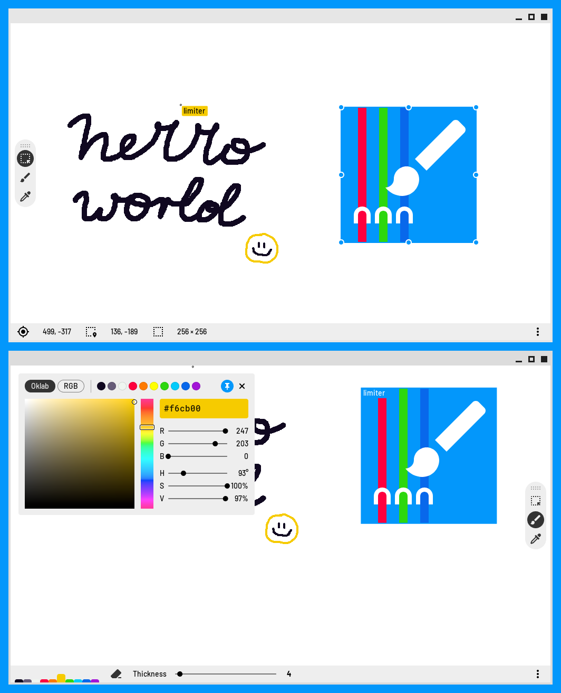

# NetCanv

A lightweight app for painting with other people over the Internet, in real time.


<p align="center">
A screenshot of my imaginary friend and I painting things together using NetCanv.
</p>

- **Lightweight.** The whole app fits in about 10 MB, and unlike web apps, you only ever have to
  download a specific version once.
- **Fast.** NetCanv uses a fully hardware-accelerated canvas to deliver you the smoothest drawing
  experience possible. Additionally, the network protocol is really simple, which makes NetCanv run
  well even on the slowest connections.
- **Decentralized.** Even if one server goes down, you could find another one, or set one up on
  your own.
- **Free.** NetCanv is and will always be free to use, by anyone, for any purpose.
  It's licensed under the GNU General Public License 3, which means that all of NetCanv's
  derivatives must remain free, as well.
- **Open source.** _You_ can be a part of NetCanv's development! If you have a feature you'd like
  to see added, or you think you've found a bug, head over to the [Issues](https://github.com/liquidev/netcanv/issues)
  tab. If you know how to code, feel free to send in [Pull Requests](https://github.com/liquidev/netcanv/pulls)!
- **Made with 💙** by a high school student with too much time on his hands.

## Compiling

Should be as simple as:

```sh
$ cargo build --release
# or, if you just want to run the app:
$ cargo run --release
```

### Features

Alternate rendering backends can be chosen by passing in features via the `--features` flag.

- `renderer-opengl` (default) – The OpenGL rendering backend. May be incomplete or buggy in some
  places on certain drivers, please file issue reports if you find bugs!

Right now this is the only backend available. Do note that PRs implementing alternate backends will
not be merged, because the rendering API is still in flux and may change at any time. More backends
may be added after 1.0 is released.

#### Skia backend

There used to be a Skia backend, but it was removed because it was an unsupported, unnecessary
maintenance burden. The last tag to feature this backend is [0.5.0](https://github.com/liquidev/netcanv/tree/0.5.0).

### Matchmaker

NetCanv assumes that you have your own matchmaker up: currently the default value
in the matchmaker textbox is `localhost`, for easy testing.

To run the matchmaker, simply do:
```sh
$ cd netcanv-matchmaker
$ cargo run --release
```

This will allow you to host and join new rooms locally.

## "Tutorial"

NetCanv was originally made as part of a YouTube "tutorial" series.

The series is in Polish (!) and can be found on
[YouTube](https://www.youtube.com/playlist?list=PL1Hg-PZUNFkeRdErHKx3Z7IwhJNgij3bJ).

Individual episodes:

1. [Introduction](https://www.youtube.com/watch?v=ZeSXVgjrivY)
2. [Drawing and GUI](https://www.youtube.com/watch?v=MVEILFrPKnY)
3. [Refactoring and ∞](https://www.youtube.com/watch?v=mECVCb87sAQ)
4. Networking – coming soon

Again, note that the tutorials are in Polish.

### Purpose

The main purpose of this tutorial series is to show how to build a desktop app
using Rust and Skia, together with peer-to-peer communication for realtime
collaboration.

I generally don't like explaining every small detail in my videos. I'd rather
showcase the cool and interesting parts about the development process. So don't
consider this as a general Rust application development tutorial – treat it more
like a devlog with some educational, comedic, and artistic value sprinkled
over it.
